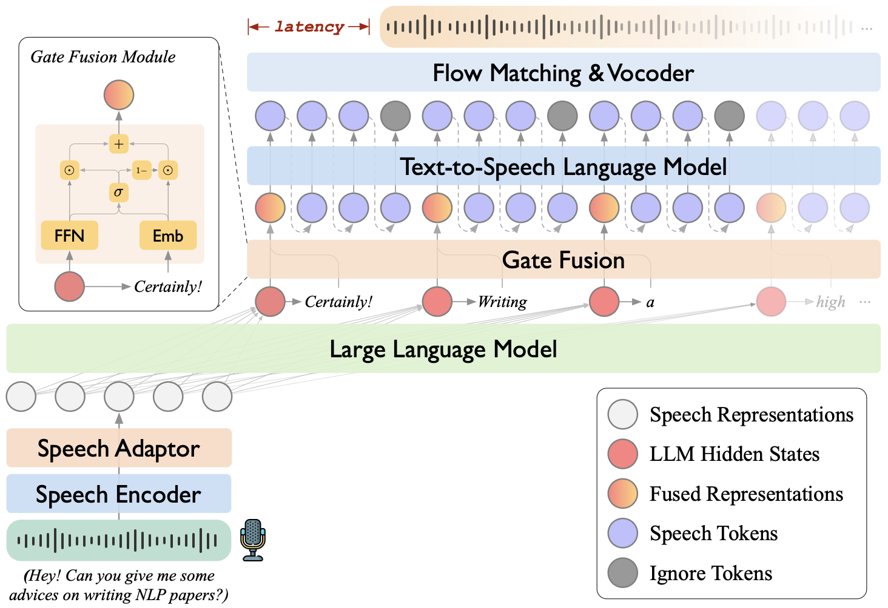

# 🦙🎧 LLaMA-Omni 2: LLM-based Real-time Spoken Chatbot with Autoregressive Streaming Speech Synthesis

> **Authors: [Qingkai Fang](https://fangqingkai.github.io/), [Yan Zhou](https://zhouyan19.github.io/zhouyan/), [Shoutao Guo](https://scholar.google.com/citations?hl=en&user=XwHtPyAAAAAJ), [Shaolei Zhang](https://zhangshaolei1998.github.io/), [Yang Feng*](https://people.ucas.edu.cn/~yangfeng?language=en)**

[](https://arxiv.org/abs/2505.02625)
[](https://github.com/ictnlp/LLaMA-Omni2)
[](https://huggingface.co/collections/ICTNLP/llama-omni-67fdfb852c60470175e36e9c)
[](https://huggingface.co/datasets/ICTNLP/Multiturn-Speech-Conversations)

LLaMA-Omni 2 is a series of speech-language models built on the Qwen2.5-0.5B/1.5B/3B/7B/14B/32B-Instruct models. Similar to [LLaMA-Omni](https://github.com/ictnlp/LLaMA-Omni), it can generate both text and speech responses simultaneously, enabling high-quality and low-latency speech interaction. With the newly introduced streaming autoregressive speech decoder, LLaMA-Omni 2 achieves higher speech quality compared to LLaMA-Omni.

<div align="center"></div>

## 🔥 News

- [25/05] LLaMA-Omni 2 is accepted at ACL 2025 main conference!

## Install

1. Clone this repository.

```shell
git clone https://github.com/ictnlp/LLaMA-Omni2
cd LLaMA-Omni2
```

2. Install packages.

```shell
conda create -n llama-omni2 python=3.10
conda activate llama-omni2
pip install -e .
```

## Quick Start

1. Download the `Whisper-large-v3` model.

```shell
import whisper
model = whisper.load_model("large-v3", download_root="models/speech_encoder/")
```

2. Download the flow-matching model and vocoder of `CosyVoice 2`.

```shell
huggingface-cli download --resume-download ICTNLP/cosy2_decoder --local-dir models/cosy2_decoder
```

> [!Tip]
> If you’re experiencing unstable connections to Hugging Face from within China, you can try setting the following in your command line:
> 
> ```shell
> export HF_ENDPOINT=https://hf-mirror.com
> ```

3. Download the LLaMA-Omni2 series models from Hugging Face. `LLaMA-Omni2-0.5B/1.5B/3B/7B/14B` support **English only**, while `LLaMA-Omni2-0.5B/1.5B/3B/7B/14B/32B-Bilingual` support **both English and Chinese**.

```shell
model_name=LLaMA-Omni2-7B-Bilingual
huggingface-cli download --resume-download ICTNLP/$model_name --local-dir models/$model_name
```

| LLaMA-Omni2                                                           | LLaMA-Omni2-Bilingual                                                                     |
| --------------------------------------------------------------------- | ----------------------------------------------------------------------------------------- |
| 🤗 [LLaMA-Omni2-0.5B](https://huggingface.co/ICTNLP/LLaMA-Omni2-0.5B) | 🤗 [LLaMA-Omni2-0.5B-Bilingual](https://huggingface.co/ICTNLP/LLaMA-Omni2-0.5B-Bilingual) |
| 🤗 [LLaMA-Omni2-1.5B](https://huggingface.co/ICTNLP/LLaMA-Omni2-1.5B) | 🤗 [LLaMA-Omni2-1.5B-Bilingual](https://huggingface.co/ICTNLP/LLaMA-Omni2-1.5B-Bilingual) |
| 🤗 [LLaMA-Omni2-3B](https://huggingface.co/ICTNLP/LLaMA-Omni2-3B)     | 🤗 [LLaMA-Omni2-3B-Bilingual](https://huggingface.co/ICTNLP/LLaMA-Omni2-3B-Bilingual)     |
| 🤗 [LLaMA-Omni2-7B](https://huggingface.co/ICTNLP/LLaMA-Omni2-7B)     | 🤗 [LLaMA-Omni2-7B-Bilingual](https://huggingface.co/ICTNLP/LLaMA-Omni2-7B-Bilingual)     |
| 🤗 [LLaMA-Omni2-14B](https://huggingface.co/ICTNLP/LLaMA-Omni2-14B)   | 🤗 [LLaMA-Omni2-14B-Bilingual](https://huggingface.co/ICTNLP/LLaMA-Omni2-14B-Bilingual)   |
| -                                                                     | 🤗 [LLaMA-Omni2-32B-Bilingual](https://huggingface.co/ICTNLP/LLaMA-Omni2-32B-Bilingual)   |

## Gradio Demo

1. Launch a controller.
   
   ```shell
   python -m llama_omni2.serve.controller --host 0.0.0.0 --port 10000
   ```

2. Launch a gradio web server.
   
   ```shell
   python -m llama_omni2.serve.gradio_web_server --controller http://localhost:10000 --port 8000 --vocoder-dir models/cosy2_decoder
   ```

3. Launch a model worker.
   
   ```shell
   python -m llama_omni2.serve.model_worker --host 0.0.0.0 --controller http://localhost:10000 --port 40000 --worker http://localhost:40000 --model-path models/$model_name --model-name $model_name
   ```

4. Visit [http://localhost:8000/](http://localhost:8000/) and interact with LLaMA-Omni2!

## Local Inference

```shell
output_dir=examples/$model_name
mkdir -p $output_dir

python llama_omni2/inference/run_llama_omni2.py \
    --model_path models/$model_name \
    --question_file examples/questions.json \
    --answer_file $output_dir/answers.jsonl \
    --temperature 0 \
    --s2s

python llama_omni2/inference/run_cosy2_decoder.py \
    --input-path $output_dir/answers.jsonl \
    --output-dir $output_dir/wav \
    --lang en
```

## LICENSE

Our code is released under the Apache-2.0 License. Our model is intended for academic research purposes only and may **NOT** be used for commercial purposes.

You are free to use, modify, and distribute this model in academic settings, provided that the following conditions are met:

- **Non-commercial use**: The model may not be used for any commercial purposes.
- **Citation**: If you use this model in your research, please cite the original work.

### Commercial Use Restriction

For any commercial use inquiries or to obtain a commercial license, please contact `fengyang@ict.ac.cn`.

## Acknowledgements

- [CosyVoice 2](https://github.com/FunAudioLLM/CosyVoice): We use the pretrained speech tokenizer, flow-matching model and vocoder of CosyVoice 2.
- [SLAM-LLM](https://github.com/X-LANCE/SLAM-LLM): We borrow some code about speech encoder and speech adaptor.

## Citation

If you have any questions, please feel free to submit an issue or contact `fangqingkai21b@ict.ac.cn`.

If our work is useful for you, please cite as:

```
@inproceedings{
  fang2025llamaomni2,
  title={{LL}a{MA}-{O}mni 2: LLM-based Real-time Spoken Chatbot with Autoregressive Streaming Speech Synthesis},
  author={Fang, Qingkai and Zhou, Yan and Guo, Shoutao and Zhang, Shaolei and Feng, Yang},
  booktitle = {Proceedings of the 63rd Annual Meeting of the Association for Computational Linguistics},
  year={2025}
}

@inproceedings{
  fang2025llamaomni,
  title={{LL}a{MA}-{O}mni: Seamless Speech Interaction with Large Language Models},
  author={Qingkai Fang and Shoutao Guo and Yan Zhou and Zhengrui Ma and Shaolei Zhang and Yang Feng},
  booktitle={The Thirteenth International Conference on Learning Representations},
  year={2025},
  url={https://openreview.net/forum?id=PYmrUQmMEw}
}
```
